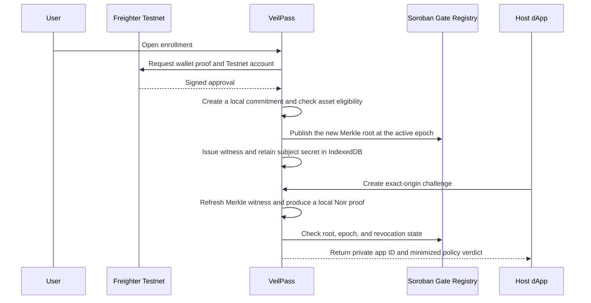
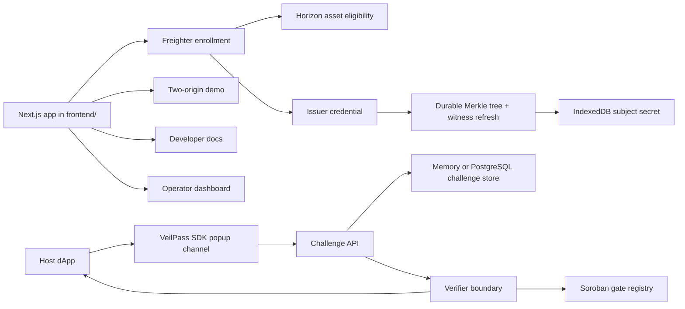

<div align="center">
  
  <h1>VeilPass</h1>
  <p>Origin-scoped private eligibility login for Stellar Testnet apps.</p>

  <a href="https://veilpass.dev"></a>
  
  
  
  
</div>

---

VeilPass is a Stellar Testnet MVP for **origin-scoped, eligibility-gated login**.

A host dApp can learn that a user passed a policy, such as holding the required testnet asset, without receiving the user's Stellar wallet address. The host receives a stable app-scoped private ID and a minimized policy verdict. The enrollment issuer still sees the wallet during enrollment.

> [!IMPORTANT]
> VeilPass is **not an anonymity system**. The MVP does not hide IP address, browser fingerprint, timing, device state, issuer-side enrollment knowledge, or future on-chain activity. It only enforces the explicit privacy boundary documented in this repo: host apps do not receive the wallet address during verification.

[Live Demo](https://veilpass.dev) · [Developer docs](https://veilpass.dev/docs) · [Quickstart](https://veilpass.dev/docs/quickstart) · [API reference](https://veilpass.dev/docs/api) · [Changelog](CHANGELOG.md) · [Test Report](frontend/docs/evidence/test-report.md) · [Contract Evidence](frontend/docs/evidence/contract.md) · [Proof Boundary](frontend/docs/evidence/proof.md) · [Delivery Status](frontend/docs/evidence/delivery-status.md)

---

## What Is VeilPass?

VeilPass is a login and verification layer for apps that need eligibility checks without exposing a user's wallet address to every host origin.

Instead of asking a host app to inspect a wallet directly, VeilPass separates the flow:

```text
User wallet
-> VeilPass enrollment + proof surface
-> origin-scoped verifier
-> host dApp receives private app ID + policy verdict
```

VeilPass handles:

- Freighter Testnet enrollment.
- Stellar asset eligibility checks.
- Issuer-signed credentials.
- Origin-specific private app IDs.
- Exact-origin host challenge validation.
- Popup/message-channel verification for host dApps.
- Replay-resistant challenge consumption.
- A Soroban gate registry on Stellar Testnet.
- Browser-local Noir/UltraHonk membership proofs verified by the server against a pinned verification key.

The product goal is narrow and deliberate: prove the private-login loop, preserve the privacy boundary, and avoid overstating what the MVP hides.

---

## Review Path

For a reviewer or demo session, the shortest path is:

1. Open [https://veilpass.dev](https://veilpass.dev).
2. Review the landing page privacy language; it should not claim anonymity.
3. Open `/demo` for the clearly labeled simulation, then use the live App A and App B origins for acceptance.
4. Confirm same-origin IDs stay stable while cross-origin IDs differ in the live host results.
5. Open `/dashboard` to review the gate registry and operator surfaces.
6. Open `/dashboard/enroll` with Freighter set to Stellar Testnet.
7. Accept the disclosure, then select **Connect Freighter and enroll**. The default gate checks the wallet's native Testnet XLM balance; it does not create a custom-asset trustline or claim.
8. Complete enrollment and verify that the host receives a minimized success result without a wallet address. Its verification request still carries the proof and public inputs. No swap, token purchase, or custom-asset setup is required; this live step still requires the durable database and gate-root publisher environment values described below.
9. Check `frontend/docs/evidence/` for captured local test results, visuals, contract evidence, and proof boundary notes.

---

## Core Flow



The host never receives the Stellar wallet address from the verifier response.

---

## Architecture



### Stack

- **Frontend:** Next.js 16, React 19, Tailwind CSS, shadcn/ui foundation.
- **Wallet:** Freighter on Stellar Testnet.
- **Stellar reads:** Horizon and Stellar RPC.
- **Contract:** Soroban gate registry in `contracts/veilpass-gate`.
- **Storage:** PostgreSQL is required for production challenge, enrollment, session, and Merkle-tree state; memory adapters are development-only.
- **Proof boundary:** the hosted page generates the Noir/UltraHonk proof locally; the verifier uses the pinned verification key and returns no wallet data to the host.
- **Deployment:** Vercel-hosted Next.js frontend from `frontend/`; production readiness depends on durable database, exact origins, current contract/tree policy, signing keys, and adequate function execution limits.

---

## Features

### User / Holder

- Connect Freighter on Stellar Testnet.
- Complete an eligibility enrollment flow.
- Store a subject secret locally in IndexedDB.
- Receive an issuer credential for the configured gate policy.
- Verify into host apps without handing the host a wallet address.

### Host Developer

- Use the SDK popup channel.
- Request an exact-origin challenge.
- Receive only a minimized verification response.
- Get stable same-origin app IDs and different cross-origin IDs.
- Reject replayed, revoked, malformed, or origin-mismatched attempts.

### Operator / Reviewer

- Inspect gate registry data from the dashboard.
- Run local contract tests and Testnet smoke checks.
- Review documented evidence for tests, visual captures, contract deployment, privacy claims, and proof limitations.

---

## API Surface

| Origin | Method | Path | Description |
| --- | --- | --- | --- |
| Host app (each allowed host origin) | `POST` | `/api/challenges` | Host-owned route creates a digest-only challenge bound to that origin and gate |
| Host app (each allowed host origin) | `POST` | `/api/verify` | Host-owned route consumes the challenge and returns the minimized verifier result |
| Host app (example adapter) | `GET` | `/api/session` | Reads that host's opaque HTTP-only session after its verifier route creates one |
| VeilPass login service | `POST` | `/api/credentials/witness` | Refreshes a signed credential's Merkle path at the current contract root |
| VeilPass login service | `POST` | `/api/proof/simulate` | Non-production compatibility fixture; the verifier never accepts it |
| VeilPass login service | `POST` | `/api/enrollment/eligibility` | Enrollment preflight against the configured Testnet eligibility rule |
| VeilPass login service | `POST` | `/api/enrollment/challenge` | Checks eligibility and creates the Freighter enrollment challenge |
| VeilPass login service | `POST` | `/api/enrollment/issue` | Verifies the signature and issues a credential/root update |
| VeilPass login service | `POST` | `/api/demo-asset/challenge` | Creates an origin- and wallet-bound proof request for the fixed Testnet fixture |
| VeilPass login service | `POST` | `/api/demo-asset/issue` | Verifies the Freighter signature and issues the fixed fixture once per wallet |
| VeilPass login service | `GET` | `/api/health` | Reports redacted runtime-configuration readiness |

The table lists this repository's demo/login service routes, not a backend automatically supplied by the npm SDK. The browser SDK makes same-origin requests to the host application's `POST /api/challenges` and `POST /api/verify`; every third-party host app must implement those routes, durable atomic challenge/nullifier storage, chain/policy reads, a pinned cryptographic verifier, rate/body limits, and its own session boundary. See [Quickstart](https://veilpass.dev/docs/quickstart), [server integration](https://veilpass.dev/docs/server), and the [package READMEs](frontend/packages/).

The host's `/api/verify` receives proof bytes and public inputs (including commitment/root, one-time nullifier, revocation hash, origin, and challenge binding). The SDK does not return those fields to application code, but the host's server, reverse proxy, and observability stack can see them. Treat the request body as sensitive transient data: **do not log, trace, persist, or attach it to analytics/support reports**. The no-wallet-address claim is not a claim that proof data is anonymous or non-sensitive.

### Published npm packages

The following packages are the public integration surface currently published on npm. Each package-level README is included in its tarball and rendered on its npm page:

| Package | Responsibility | Documentation |
| --- | --- | --- |
| [`@veilpass/sdk`](https://www.npmjs.com/package/@veilpass/sdk) | Browser popup client; calls host-owned `/api/challenges` and `/api/verify` routes | [README](frontend/packages/sdk/README.md) |
| [`@veilpass/server`](https://www.npmjs.com/package/@veilpass/server) | Server-side verification policy primitive; does not include database, chain, verifier-key, or HTTP adapters | [README](frontend/packages/server/README.md) |
| [`@veilpass/shared`](https://www.npmjs.com/package/@veilpass/shared) | Strict shared schemas, error codes, and origin/field helpers | [README](frontend/packages/shared/README.md) |

These packages are integration primitives, not a drop-in authentication backend. Do not infer that installing them provisions VeilPass service infrastructure or makes a host application production-ready.

---

## Local Development

Requirements:

- Node.js 20 or later.
- npm.
- Rust/Cargo.
- Stellar CLI 26 or later.
- Freighter for wallet enrollment.

Run the app from the frontend workspace:

```powershell
cd frontend
npm install
npm run env:local
npm run env:validate
npm run dev
```

`npm run env:local` creates an ignored development template and generates an issuer key, but intentionally leaves `VEILPASS_GATE_OWNER_SECRET` empty and does not provision PostgreSQL. It is not a complete live-enrollment setup. Before Testnet issuance, configure the actual owner secret for the deployed gate, a durable `DATABASE_URL`, and a Merkle tree/root aligned to the current on-chain state; then run `npm run env:validate`. Never copy a production owner key into an untrusted local machine.

Open:

```text
http://localhost:3000
```

The generated `frontend/.env.local` supports the landing page, docs, fixture demo, dashboard, and live contract read path. It is ignored by git.

For the public Testnet demo, VeilPass uses a native XLM eligibility rule: the wallet must hold the configured minimum Testnet XLM balance. This satisfies the asset-based eligibility gate without requiring a custom token, an issuer, a trustline, a swap, or a faucet. SDK and host-dApp integrators never need to manage wallet balances or assets.

An operator may configure a credit asset such as USDC instead by setting `VEILPASS_ASSET_TYPE=credit` and supplying the exact code and issuer. That policy intentionally restores the holder's trustline requirement. The legacy `npm run asset:issue -- <FREIGHTER_TESTNET_PUBLIC_KEY>` command is only for a credit-asset test fixture and is not part of the native-XLM reviewer or developer journey.

---

## Environment Variables

Template:

```powershell
cd frontend
Copy-Item .env.example .env.local
```

Or generate a complete local Testnet file:

```powershell
cd frontend
npm run env:local
```

Required production variables:

```text
VEILPASS_HOST_ORIGIN=
VEILPASS_LOGIN_ORIGIN=
NEXT_PUBLIC_VEILPASS_LOGIN_ORIGIN=
NEXT_PUBLIC_STELLAR_NETWORK=TESTNET
NEXT_PUBLIC_STELLAR_RPC_URL=https://soroban-testnet.stellar.org
NEXT_PUBLIC_VEILPASS_CONTRACT_ID=
NEXT_PUBLIC_VEILPASS_SOURCE_ACCOUNT=
VEILPASS_GATE_IDS=premium-holder
VEILPASS_GATE_EPOCH=1
VEILPASS_CREDENTIAL_ROOT=
VEILPASS_ASSET_TYPE=native
VEILPASS_ASSET_CODE=XLM
VEILPASS_ASSET_ISSUER=
VEILPASS_MIN_BALANCE=1
# Optional Testnet-only global safety cap; defaults to 100 claims per rolling 24 hours.
VEILPASS_DEMO_ASSET_DAILY_LIMIT=100
VEILPASS_SIMULATOR_KEY=
VEILPASS_ISSUER_SECRET=
VEILPASS_GATE_OWNER_SECRET=
VEILPASS_FIXTURE_CREDENTIAL=
DATABASE_URL=
```

This is a consolidated inventory, not a claim that every variable is needed by every route. The runtime validator reports the structural checks required by the full issuer/login deployment. `NEXT_PUBLIC_*` values are intentionally public; issuer/owner secrets, fixture credentials, simulator keys, and database URLs must remain server-only. See [runtime configuration](https://veilpass.dev/docs/quickstart) and [`frontend/.env.example`](frontend/.env.example) for the local template.

Important rules:

- Do not commit `.env.local`.
- Run `npm run env:validate` before a live deployment. It reports only missing or malformed variable names; it never outputs configuration values or secrets.
- Never prefix issuer, simulator, fixture credential, or database secrets with `NEXT_PUBLIC_`.
- Set exact origins only; do not include paths.
- Production replay protection and atomic challenge consumption require `DATABASE_URL`.
- The Testnet fixture is issued only after Freighter signs a message bound to the exact login origin, wallet, asset, amount, and nonce. PostgreSQL records one irreversible claim per wallet and serializes the rolling daily cap.
- The host verifier response must remain minimized and must not include the wallet address.

---

## Contract

Soroban workspace:

```text
contracts/veilpass-gate
```

Current Testnet deployment:

| Field | Value |
| --- | --- |
| Contract ID | `CDENQIJD2CJJPBW74JQWF35SPRFK53XPF6FFFBJTD2UYESHI6I7CHYEK` |
| Source account | `GDVP7QVOCQ4L4CDNXVWD53ATXGYDXTDOYVFPJ3UA5OTWJW7XGXSNFXRJ` |
| Gate ID | `premium-holder` |
| Epoch | `1` |
| Credential root | Read the current value with `npm run contract:smoke`; it changes after enrollment and must match the durable Merkle tree. |

Commands:

```powershell
cd frontend
npm run contract:test
npm run contract:smoke
stellar contract build --manifest-path ../contracts/veilpass-gate/Cargo.toml --locked
../contracts/veilpass-gate/scripts/deploy-testnet.ps1 -Identity <stellar-cli-identity>
```

Deployment evidence lives in [frontend/docs/evidence/contract.md](frontend/docs/evidence/contract.md).

---

## Proof Toolchain

`frontend/packages/proof/circuits/membership` contains the Noir source.

The hosted login uses the checked-in circuit artifact and creates an UltraHonk proof locally. `api/proof/simulate` remains an isolated non-production compatibility fixture; `/api/verify` never accepts it.

Use WSL for the official Noir/Barretenberg toolchain on Windows:

```bash
cd frontend/packages/proof/circuits/membership
nargo test
nargo compile
```

Rebuild and validate the browser artifact and pinned verification key with:

```powershell
npm run proof:artifacts
npm run proof:runtime
```

The runtime command executes the circuit through NoirJS, creates an UltraHonk proof, and checks it with the committed VK.

### Live issuer prerequisites

Production enrollment intentionally fails closed until all of the following are configured:

- `DATABASE_URL` for durable challenge, nullifier, enrollment, and Merkle-tree records;
- `VEILPASS_GATE_OWNER_SECRET`, held only by the service that is authorized to publish `update_root` transactions; and
- a gate whose current root matches the durable Merkle tree. A fresh empty tree requires an empty root in a new epoch; do not overwrite an active root just to make enrollment pass.

`VEILPASS_GATE_OWNER_SECRET` is distinct from `VEILPASS_ISSUER_SECRET`. It is never sent to the browser. The deployed Testnet gate must be initialized by its actual owner before the first enrollment. If the active on-chain root differs from an empty local tree, restore the matching tree or rotate to a fresh epoch with the owner; overwriting the current root in place can invalidate existing credentials.

The exact final acceptance sequence, including two public origins, Freighter approval, rejection cases, and the review recording, is in [the live acceptance checklist](frontend/docs/evidence/live-acceptance-checklist.md).

---

## Deployment

VeilPass is deployed as a Vercel project from the `frontend` directory.

Vercel project settings:

```text
Root Directory: frontend
Install Command: npm install
Build Command: npm run build
Output Directory: Next.js default
Node.js Version: 20.x or newer
```

The configured Vercel Root Directory is `frontend`. Run the CLI from the repository root, where the linked Vercel project configuration lives; launching the CLI from `frontend/` can resolve the configured root a second time and build the wrong directory.

Deploy:

```powershell
npx vercel --prod --yes
```

Production URL:

```text
https://veilpass.dev
```

Configure environment variables in Vercel. Do not commit `frontend/.env.local`.

---

## Verification Checklist

Run from `frontend/`:

```powershell
npm run lint
npm run typecheck
npm run docs:check
npm test
npm run contract:test
npm run contract:smoke
npm run test:e2e
npm run test:a11y
npm run build
npm audit --omit=dev
```

Expected current results:

| Check | Status |
| --- | --- |
| ESLint | Pass |
| TypeScript | Pass |
| Vitest | Run `npm test` for the current count; see the dated test report for verified results. |
| Noir fixture | Pinned circuit test, witness, UltraHonk proof, and verification pass |
| Soroban Rust tests | 3 tests passing |
| Stellar Testnet smoke | Pass |
| Playwright e2e | Run `npm run test:e2e` for the current count; see the dated test report for verified results. |
| Axe accessibility checks | Included in `npm run test:a11y`; see the dated test report for verified results. |
| Production build | Pass locally and on Vercel |
| Runtime dependency audit | 0 vulnerabilities |

---

## Evidence

Tracked evidence lives under `frontend/docs/evidence/`.

| Evidence | File |
| --- | --- |
| Full local verification report | [test-report.md](frontend/docs/evidence/test-report.md) |
| Privacy claim audit | [claim-audit.md](frontend/docs/evidence/claim-audit.md) |
| Contract deployment and smoke evidence | [contract.md](frontend/docs/evidence/contract.md) |
| Proof boundary documentation | [proof.md](frontend/docs/evidence/proof.md) |
| Proposal delivery status | [delivery-status.md](frontend/docs/evidence/delivery-status.md) |
| Deliverable implementation audit | [audit-deliverable-1-5-2026-09-10.md](frontend/docs/evidence/audit-deliverable-1-5-2026-09-10.md) |
| Live-acceptance operator runbook | [operator-acceptance-runbook-2026-09-10.md](frontend/docs/evidence/operator-acceptance-runbook-2026-09-10.md) |
| Landing screenshot | [landing-desktop.png](frontend/docs/evidence/landing-desktop.png) |
| Demo screenshot | [demo-desktop.png](frontend/docs/evidence/demo-desktop.png) |

---

## Project Structure

```text
veilpass/
├── contracts/
│   └── veilpass-gate/          # Soroban gate registry contract
├── frontend/                   # Next.js app, env template, docs, SDK packages, tests
│   ├── app/                    # App Router pages and API routes
│   ├── components/             # shadcn/ui-based product UI
│   ├── docs/evidence/          # Test, contract, proof, and visual evidence
│   ├── lib/                    # Server, security, Stellar, and demo logic
│   ├── packages/               # SDK, server, shared, proof, credential packages
│   ├── public/brand/           # VeilPass logo and favicon assets
│   ├── scripts/                # Local env and asset issuance helpers
│   └── tests/                  # Playwright e2e/a11y coverage
├── .veilpass-handoff/          # Copied reference handoff, git-ignored
└── README.md
```

---

## MVP Boundaries

- Stellar Network.
- Freighter only.
- Eligibility is based on the configured testnet asset and gate policy.
- The enrollment issuer sees the wallet address.
- The host verifier must not receive the wallet address.
- The hosted login produces a local Noir/UltraHonk membership proof; the verifier uses the pinned VK.
- The compiler check runs through the pinned WSL toolchain on Windows and emits the reviewed browser artifact.
- IP address, timing, browser/device fingerprinting, and later on-chain activity remain outside the privacy boundary.
- Production challenge, enrollment, session, and Merkle-tree persistence require PostgreSQL via `DATABASE_URL`.

---

## Reviewer Wallet Setup

The remaining wallet-controlled interaction is intentionally small and cannot be bypassed by the application:

1. Open Freighter on Stellar Testnet and make sure the account has enough XLM for Stellar's Testnet base reserve and transaction fee.
2. Fund the Testnet account with at least the configured minimum XLM through Stellar Friendbot, then open [`https://login.veilpass.dev/dashboard/enroll`](https://login.veilpass.dev/dashboard/enroll), read and accept the enrollment disclosure, and select **Connect Freighter and enroll**.
3. Inspect and approve the enrollment message in Freighter. Native XLM requires no custom asset trustline or claim transaction.
4. Approve the separate enrollment message. The credential remains in that browser; App A and App B receive only scoped private IDs.

The claim is deliberately limited to one fixed Testnet balance per wallet and is not a general token faucet, payment, transfer, or production asset distribution service.
