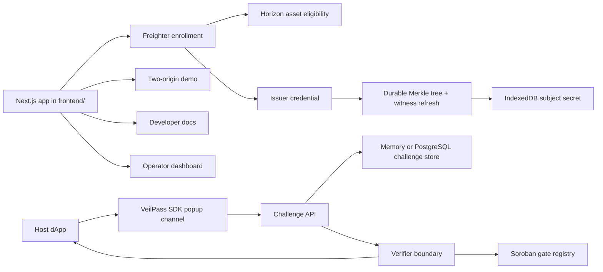

<div align="center">
  
  <h1>VeilPass</h1>
  <p>Origin-scoped private eligibility login for Stellar Testnet apps.</p>

  <a href="https://veilpass-stellar.vercel.app"></a>
  
  
  
  
</div>

---

VeilPass is a Stellar Testnet MVP for **origin-scoped, eligibility-gated login**.

A host dApp can learn that a user passed a policy, such as holding the required testnet asset, without receiving the user's Stellar wallet address. The host receives a stable app-scoped private ID and a minimized policy verdict. The enrollment issuer still sees the wallet during enrollment.

> [!IMPORTANT]
> VeilPass is **not an anonymity system**. The MVP does not hide IP address, browser fingerprint, timing, device state, issuer-side enrollment knowledge, or future on-chain activity. It only enforces the explicit privacy boundary documented in this repo: host apps do not receive the wallet address during verification.

[Live Demo](https://veilpass-stellar.vercel.app) · [Test Report](frontend/docs/evidence/test-report.md) · [Contract Evidence](frontend/docs/evidence/contract.md) · [Proof Boundary](frontend/docs/evidence/proof.md) · [Delivery Status](frontend/docs/evidence/delivery-status.md) · [Frontend Docs](frontend/app/docs/[[...slug]]/page.tsx)

---

## What Is VeilPass?

VeilPass is a login and verification layer for apps that need eligibility checks without exposing a user's wallet address to every host origin.

Instead of asking a host app to inspect a wallet directly, VeilPass separates the flow:

```text
User wallet
-> VeilPass enrollment + proof surface
-> origin-scoped verifier
-> host dApp receives private app ID + policy verdict
```

VeilPass handles:

- Freighter Testnet enrollment.
- Stellar asset eligibility checks.
- Issuer-signed credentials.
- Origin-specific private app IDs.
- Exact-origin host challenge validation.
- Popup/message-channel verification for host dApps.
- Replay-resistant challenge consumption.
- A Soroban gate registry on Stellar Testnet.
- Browser-local Noir/UltraHonk membership proofs verified by the server against a pinned verification key.

The product goal is narrow and deliberate: prove the private-login loop, preserve the privacy boundary, and avoid overstating what the MVP hides.

---

## Review Path

For a reviewer or demo session, the shortest path is:

1. Open [https://veilpass-stellar.vercel.app](https://veilpass-stellar.vercel.app).
2. Review the landing page privacy language; it should not claim anonymity.
3. Open `/demo` and compare App A and App B behavior.
4. Confirm same-origin IDs stay stable while cross-origin IDs differ.
5. Open `/dashboard` to review the gate registry and operator surfaces.
6. Open `/dashboard/enroll` with Freighter set to Stellar Testnet.
7. Add the testnet `VPT` trustline in Freighter.
8. Issue the testnet asset locally to the Freighter wallet.
9. Complete enrollment and verify that the host receives only the minimized private result. This live step requires the durable database and gate-root publisher environment values described below.
10. Check `frontend/docs/evidence/` for captured local test results, visuals, contract evidence, and proof boundary notes.

---

## Core Flow

```mermaid
sequenceDiagram
  participant User
  participant Wallet as Freighter Testnet
  participant VeilPass
  participant Contract as Soroban Gate Registry
  participant Host as Host dApp

  User->>VeilPass: Open enrollment
  VeilPass->>Wallet: Request wallet proof and Testnet account
  Wallet-->>VeilPass: Signed approval
  VeilPass->>VeilPass: Create a local commitment and check asset eligibility
  VeilPass->>Contract: Publish the new Merkle root at the active epoch
  VeilPass->>VeilPass: Issue witness; retain subject secret in IndexedDB
  Host->>VeilPass: Create exact-origin challenge
  VeilPass->>VeilPass: Refresh Merkle witness and produce a local Noir proof
  VeilPass->>Contract: Check root, epoch, and revocation state
  VeilPass-->>Host: Return private app ID and minimized policy verdict
```

The host never receives the Stellar wallet address from the verifier response.

---

## Architecture



### Stack

- **Frontend:** Next.js 16, React 19, Tailwind CSS, shadcn/ui foundation.
- **Wallet:** Freighter on Stellar Testnet.
- **Stellar reads:** Horizon and Stellar RPC.
- **Contract:** Soroban gate registry in `contracts/veilpass-gate`.
- **Storage:** PostgreSQL is required for production challenge, enrollment, session, and Merkle-tree state; memory adapters are development-only.
- **Proof boundary:** the hosted page generates the Noir/UltraHonk proof locally; the verifier uses the pinned verification key and returns no wallet data to the host.
- **Deployment:** Vercel Hobby-compatible frontend deployment from `frontend/`.

---

## Features

### User / Holder

- Connect Freighter on Stellar Testnet.
- Complete an eligibility enrollment flow.
- Store a subject secret locally in IndexedDB.
- Receive an issuer credential for the configured gate policy.
- Verify into host apps without handing the host a wallet address.

### Host Developer

- Use the SDK popup channel.
- Request an exact-origin challenge.
- Receive only a minimized verification response.
- Get stable same-origin app IDs and different cross-origin IDs.
- Reject replayed, revoked, malformed, or origin-mismatched attempts.

### Operator / Reviewer

- Inspect gate registry data from the dashboard.
- Run local contract tests and Testnet smoke checks.
- Review documented evidence for tests, visual captures, contract deployment, privacy claims, and proof limitations.

---

## API Surface

| Method | Path | Description |
| --- | --- | --- |
| `POST` | `/api/challenges` | Creates a digest-only host challenge |
| `POST` | `/api/verify` | Consumes a challenge and returns the minimized verifier result |
| `POST` | `/api/session` | Creates or clears the opaque HTTP-only session |
| `POST` | `/api/credentials/witness` | Refreshes a signed credential's Merkle path at the current contract root |
| `POST` | `/api/proof/simulate` | Non-production compatibility fixture; the verifier never accepts it |
| `POST` | `/api/enrollment/challenge` | Creates the enrollment challenge for Freighter signing |
| `POST` | `/api/enrollment/issue` | Checks eligibility and issues a credential |
| `GET` | `/api/health` | Reports redacted runtime-configuration readiness for the login service |

---

## Local Development

Requirements:

- Node.js 20 or later.
- npm.
- Rust/Cargo.
- Stellar CLI 26 or later.
- Freighter for wallet enrollment.

Run the app from the frontend workspace:

```powershell
cd frontend
npm install
npm run env:local
npm run env:validate
npm run dev
```

Open:

```text
http://localhost:3000
```

The generated `frontend/.env.local` supports the landing page, docs, fixture demo, dashboard, and live contract read path. It is ignored by git.

For live enrollment, first add the generated `VPT` asset in Freighter Testnet using the issuer printed by `npm run env:local`, then fund that wallet:

```powershell
cd frontend
npm run asset:issue -- <FREIGHTER_TESTNET_PUBLIC_KEY>
```

Freighter must create the trustline first. The issuer script will fail with a Stellar trustline error if the wallet has not added the asset.

---

## Environment Variables

Template:

```powershell
cd frontend
Copy-Item .env.example .env.local
```

Or generate a complete local Testnet file:

```powershell
cd frontend
npm run env:local
```

Required production variables:

```text
VEILPASS_HOST_ORIGIN=
VEILPASS_LOGIN_ORIGIN=
NEXT_PUBLIC_VEILPASS_LOGIN_ORIGIN=
NEXT_PUBLIC_STELLAR_NETWORK=TESTNET
NEXT_PUBLIC_STELLAR_RPC_URL=https://soroban-testnet.stellar.org
NEXT_PUBLIC_VEILPASS_CONTRACT_ID=
NEXT_PUBLIC_VEILPASS_SOURCE_ACCOUNT=
VEILPASS_GATE_IDS=premium-holder
VEILPASS_GATE_EPOCH=1
VEILPASS_CREDENTIAL_ROOT=
VEILPASS_ASSET_CODE=VPT
VEILPASS_ASSET_ISSUER=
VEILPASS_MIN_BALANCE=1
VEILPASS_SIMULATOR_KEY=
VEILPASS_ISSUER_SECRET=
VEILPASS_FIXTURE_CREDENTIAL=
DATABASE_URL=
```

Important rules:

- Do not commit `.env.local`.
- Run `npm run env:validate` before a live deployment. It reports only missing or malformed variable names; it never outputs configuration values or secrets.
- Never prefix issuer, simulator, fixture credential, or database secrets with `NEXT_PUBLIC_`.
- Set exact origins only; do not include paths.
- Production replay protection and atomic challenge consumption require `DATABASE_URL`.
- The host verifier response must remain minimized and must not include the wallet address.

---

## Contract

Soroban workspace:

```text
contracts/veilpass-gate
```

Current Testnet deployment:

| Field | Value |
| --- | --- |
| Contract ID | `CC7FUOFBIZ7UIOG7J66QJZCWU3L2MM4GW2HZUHMSF4ZBKOGCVZ4UYJZY` |
| Source account | `GCUSQB6ZWO633HV7M3EF6BCWSYQMTA65RJU4OMQ435OAQ3WJRIVA43VM` |
| Gate ID | `premium-holder` |
| Epoch | `1` |
| Credential root | `853beeab108a74b7fe1410d6bebb1a5bdca9ad416ebdf0cc92ab248332ad2bdc` |

Commands:

```powershell
cd frontend
npm run contract:test
npm run contract:smoke
stellar contract build --manifest-path ../contracts/veilpass-gate/Cargo.toml --locked
../contracts/veilpass-gate/scripts/deploy-testnet.ps1 -Identity <stellar-cli-identity>
```

Deployment evidence lives in [frontend/docs/evidence/contract.md](frontend/docs/evidence/contract.md).

---

## Proof Toolchain

`frontend/packages/proof/circuits/membership` contains the Noir source.

The hosted login uses the checked-in circuit artifact and creates an UltraHonk proof locally. `api/proof/simulate` remains an isolated non-production compatibility fixture; `/api/verify` never accepts it.

Use WSL for the official Noir/Barretenberg toolchain on Windows:

```bash
cd frontend/packages/proof/circuits/membership
nargo test
nargo compile
```

Rebuild and validate the browser artifact and pinned verification key with:

```powershell
npm run proof:artifacts
npm run proof:runtime
```

The runtime command executes the circuit through NoirJS, creates an UltraHonk proof, and checks it with the committed VK.

### Live issuer prerequisites

Production enrollment intentionally fails closed until all of the following are configured:

- `DATABASE_URL` for durable challenge, nullifier, enrollment, and Merkle-tree records;
- `VEILPASS_GATE_OWNER_SECRET`, held only by the service that is authorized to publish `update_root` transactions; and
- a gate whose current root is the zero field (`00` repeated 32 bytes) or whose durable tree state has already been initialized to the on-chain root.

`VEILPASS_GATE_OWNER_SECRET` is distinct from `VEILPASS_ISSUER_SECRET`. It is never sent to the browser. The deployed Testnet gate must be initialized or updated by its actual owner before the first enrollment; the dashboard exposes an explicit same-epoch **Update root** operation for that owner flow.

The exact final acceptance sequence, including two public origins, Freighter approval, rejection cases, and the review recording, is in [the live acceptance checklist](frontend/docs/evidence/live-acceptance-checklist.md).

---

## Deployment

VeilPass is deployed as a Vercel project from the `frontend` directory.

Vercel project settings:

```text
Root Directory: frontend
Install Command: npm install
Build Command: npm run build
Output Directory: Next.js default
Node.js Version: 20.x or newer
```

Deploy:

```powershell
cd frontend
npx vercel --prod --yes
```

Production URL:

```text
https://veilpass-stellar.vercel.app
```

Configure environment variables in Vercel. Do not commit `frontend/.env.local`.

---

## Verification Checklist

Run from `frontend/`:

```powershell
npm run lint
npm run typecheck
npm test
npm run contract:test
npm run contract:smoke
npm run test:e2e
npm run test:a11y
npm run build
npm audit --omit=dev
```

Expected current results:

| Check | Status |
| --- | --- |
| ESLint | Pass |
| TypeScript | Pass |
| Vitest | 58 tests passing |
| Noir fixture | Pinned circuit test, witness, UltraHonk proof, and verification pass |
| Soroban Rust tests | 3 tests passing |
| Stellar Testnet smoke | Pass |
| Playwright e2e | 26 tests passing |
| Axe accessibility checks | 8 tests passing |
| Production build | Pass locally and on Vercel |
| Runtime dependency audit | 0 vulnerabilities |

---

## Evidence

Tracked evidence lives under `frontend/docs/evidence/`.

| Evidence | File |
| --- | --- |
| Full local verification report | [test-report.md](frontend/docs/evidence/test-report.md) |
| Privacy claim audit | [claim-audit.md](frontend/docs/evidence/claim-audit.md) |
| Contract deployment and smoke evidence | [contract.md](frontend/docs/evidence/contract.md) |
| Proof boundary documentation | [proof.md](frontend/docs/evidence/proof.md) |
| Proposal delivery status | [delivery-status.md](frontend/docs/evidence/delivery-status.md) |
| Deliverable implementation audit | [audit-deliverable-1-5-2026-09-10.md](frontend/docs/evidence/audit-deliverable-1-5-2026-09-10.md) |
| Live-acceptance operator runbook | [operator-acceptance-runbook-2026-09-10.md](frontend/docs/evidence/operator-acceptance-runbook-2026-09-10.md) |
| Landing screenshot | [landing-desktop.png](frontend/docs/evidence/landing-desktop.png) |
| Demo screenshot | [demo-desktop.png](frontend/docs/evidence/demo-desktop.png) |

---

## Project Structure

```text
veilpass/
├── contracts/
│   └── veilpass-gate/          # Soroban gate registry contract
├── frontend/                   # Next.js app, env template, docs, SDK packages, tests
│   ├── app/                    # App Router pages and API routes
│   ├── components/             # shadcn/ui-based product UI
│   ├── docs/evidence/          # Test, contract, proof, and visual evidence
│   ├── lib/                    # Server, security, Stellar, and demo logic
│   ├── packages/               # SDK, server, shared, proof, credential packages
│   ├── public/brand/           # VeilPass logo and favicon assets
│   ├── scripts/                # Local env and asset issuance helpers
│   └── tests/                  # Playwright e2e/a11y coverage
├── .veilpass-handoff/          # Copied reference handoff, git-ignored
└── README.md
```

---

## MVP Boundaries

- Stellar Testnet only.
- Freighter only.
- Eligibility is based on the configured testnet asset and gate policy.
- The enrollment issuer sees the wallet address.
- The host verifier must not receive the wallet address.
- The hosted login produces a local Noir/UltraHonk membership proof; the verifier uses the pinned VK.
- The compiler check runs through the pinned WSL toolchain on Windows and emits the reviewed browser artifact.
- IP address, timing, browser/device fingerprinting, and later on-chain activity remain outside the privacy boundary.
- Production challenge, enrollment, session, and Merkle-tree persistence require PostgreSQL via `DATABASE_URL`.

---

## Remaining Setup

The code, contract, tests, and Vercel deployment are in place. The remaining user-controlled setup is wallet-specific:

1. Open Freighter on Stellar Testnet.
2. Add a trustline for `VPT` with the issuer printed by `npm run env:local`.
3. Fund the wallet:

```powershell
cd frontend
npm run asset:issue -- <FREIGHTER_TESTNET_PUBLIC_KEY>
```

After that, the live enrollment path can verify the holder against the Testnet policy.
